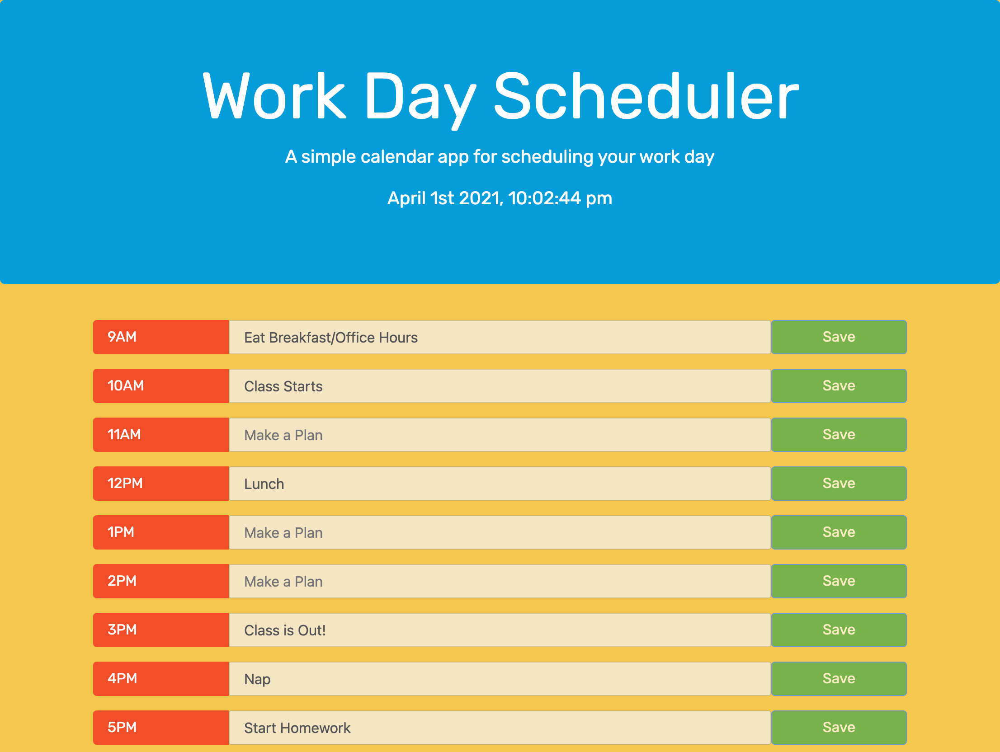

# day-planner-hw-05

## Description
This is a simple daily schedule planner. Use the input boxes to plan your day, but make sure to save when your plan is set in stone! If your plan is in the hour for the hour, the schedule will alert you by changing colors to a soft pink. If your plans are in the past the schedule will let you know by changing the color to red. Boxes in the past are no longer accessable. An updated time clock is available in at the top of the screen at all times for your reference. 

